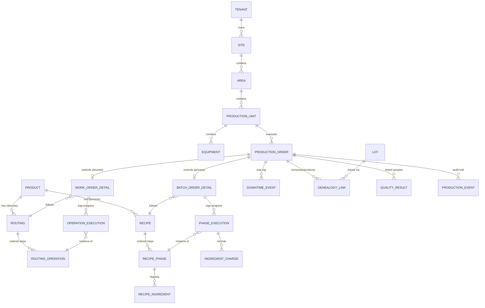

# Database Model — Production Module

**Related docs:** [Functional Design](./01-functional-design-document.md) · [Technical Design](./02-technical-design-document.md) · [Master Data Configuration](./04-master-data-configuration.md)

**Database:** PostgreSQL (+ TimescaleDB extension for time-series tables), per the architecture blueprint's Phase 1 stack decision.
**Tenancy model:** Shared schema + Row-Level Security (RLS). Every table below carries `tenant_id UUID NOT NULL` and an RLS policy `USING (tenant_id = current_setting('app.current_tenant')::uuid)`. This is non-negotiable per the multi-tenancy architecture decision — omitted from column lists below only for brevity, but present on every table.

---

## 1. Entity-relationship overview



**Design note on `PRODUCTION_ORDER`:** rather than two entirely separate order tables, this model uses a **shared header + type-specific detail table** pattern. `production_order` holds everything common to both paradigms (tenant, unit, product, quantity, status, scheduled/actual timestamps); `work_order_detail` and `batch_order_detail` hold the paradigm-specific fields and link to the header via a 1:1 (zero-or-one) relationship, discriminated by `production_order.order_type`. This avoids duplicating shared fields while keeping Discrete-only and Process-only columns out of each other's way — and lets FR-S1 (mixed dashboard) query one table for the common summary fields.

---

## 2. Master data / hierarchy tables

### `tenant`
| Column | Type | Notes |
|---|---|---|
| `id` | UUID PK | |
| `name` | text | |
| `plan_tier` | text | e.g. `core`, `analytics`, `predictive` — maps to architecture blueprint §2.4 |
| `created_at` | timestamptz | |

### `site`
| Column | Type | Notes |
|---|---|---|
| `id` | UUID PK | |
| `tenant_id` | UUID FK → tenant | |
| `name` | text | e.g. "Pune Plant" |
| `timezone` | text | IANA tz name — critical for shift calculations |

### `area`
| Column | Type | Notes |
|---|---|---|
| `id` | UUID PK | |
| `tenant_id` | UUID FK | |
| `site_id` | UUID FK → site | |
| `name` | text | e.g. "Building 2" |

### `production_unit`
| Column | Type | Notes |
|---|---|---|
| `id` | UUID PK | |
| `tenant_id` | UUID FK | |
| `area_id` | UUID FK → area | |
| `name` | text | e.g. "Line 1 — Assembly" or "Reactor Train 2" |
| `production_mode` | enum | `DISCRETE` \| `PROCESS` \| `HYBRID` — drives which order types can be released here (FR-S4) |
| `sequence` | int | display order on the dashboard |

### `equipment`
| Column | Type | Notes |
|---|---|---|
| `id` | UUID PK | |
| `tenant_id` | UUID FK | |
| `production_unit_id` | UUID FK | |
| `name` | text | |
| `equipment_type` | text | e.g. `STATION`, `REACTOR`, `TANK`, `MIXER` |
| `ideal_cycle_time_seconds` | numeric | nullable — used in Discrete OEE performance calc |
| `capacity` | numeric | nullable — e.g. reactor volume, used in Process yield calc |

---

## 3. Product / process-definition tables

### `product`
| Column | Type | Notes |
|---|---|---|
| `id` | UUID PK | |
| `tenant_id` | UUID FK | |
| `sku` | text | |
| `name` | text | |
| `uom` | text | unit of measure |
| `default_production_mode` | enum | `DISCRETE` \| `PROCESS` |

### `routing` (Discrete)
| Column | Type | Notes |
|---|---|---|
| `id` | UUID PK | |
| `tenant_id` | UUID FK | |
| `product_id` | UUID FK | |
| `version` | int | |
| `status` | enum | `DRAFT` \| `ACTIVE` \| `DEPRECATED` |

### `routing_operation`
| Column | Type | Notes |
|---|---|---|
| `id` | UUID PK | |
| `tenant_id` | UUID FK | |
| `routing_id` | UUID FK | |
| `sequence` | int | operation order |
| `name` | text | e.g. "Weld sub-assembly" |
| `default_equipment_id` | UUID FK → equipment | nullable |
| `standard_time_seconds` | numeric | |

### `recipe` (Process)
| Column | Type | Notes |
|---|---|---|
| `id` | UUID PK | |
| `tenant_id` | UUID FK | |
| `product_id` | UUID FK | |
| `version` | int | |
| `status` | enum | `DRAFT` \| `ACTIVE` \| `DEPRECATED` — FR-P1 requires ACTIVE to release |
| `theoretical_yield` | numeric | used in FR-P5 yield calc |
| `batch_size_uom` | text | |

### `recipe_phase`
| Column | Type | Notes |
|---|---|---|
| `id` | UUID PK | |
| `tenant_id` | UUID FK | |
| `recipe_id` | UUID FK | |
| `sequence` | int | |
| `name` | text | e.g. "Charge", "React", "Hold", "Discharge" |
| `target_duration_seconds` | numeric | |
| `parameter_targets` | jsonb | e.g. `{"temp_c": {"target": 85, "tolerance": 3}, "pressure_bar": {"target": 2.1, "tolerance": 0.2}}` — flexible schema since parameters vary wildly by industry |

### `recipe_ingredient`
| Column | Type | Notes |
|---|---|---|
| `id` | UUID PK | |
| `tenant_id` | UUID FK | |
| `recipe_phase_id` | UUID FK | |
| `product_id` | UUID FK | the ingredient, itself a `product` row |
| `target_quantity` | numeric | |
| `uom` | text | |

---

## 4. Production order tables

### `production_order` (shared header)
| Column | Type | Notes |
|---|---|---|
| `id` | UUID PK | |
| `tenant_id` | UUID FK | |
| `order_type` | enum | `WORK_ORDER` \| `BATCH_ORDER` — discriminator |
| `order_number` | text | human-readable, e.g. "WO-48201" |
| `production_unit_id` | UUID FK | |
| `product_id` | UUID FK | |
| `planned_quantity` | numeric | units (Discrete) or batch size (Process) |
| `actual_quantity_good` | numeric | |
| `actual_quantity_scrap` | numeric | |
| `status` | text | see FDD §4.1 / §5.1 state lists — validated in application layer, not a DB enum, since Discrete and Process have different valid states |
| `scheduled_start` | timestamptz | |
| `scheduled_end` | timestamptz | |
| `actual_start` | timestamptz | |
| `actual_end` | timestamptz | |
| `shift_id` | UUID FK → shift | |
| `created_by` | UUID FK → app_user | |

### `work_order_detail` (Discrete-only fields)
| Column | Type | Notes |
|---|---|---|
| `production_order_id` | UUID PK, FK → production_order | 1:1 |
| `tenant_id` | UUID FK | |
| `routing_id` | UUID FK | |

### `operation_execution`
| Column | Type | Notes |
|---|---|---|
| `id` | UUID PK | |
| `tenant_id` | UUID FK | |
| `work_order_id` | UUID FK → production_order | |
| `routing_operation_id` | UUID FK | |
| `status` | enum | `PENDING` \| `IN_PROGRESS` \| `COMPLETED` \| `SKIPPED` |
| `actual_start` | timestamptz | |
| `actual_end` | timestamptz | |
| `quantity_good` | numeric | |
| `quantity_scrap` | numeric | |
| `equipment_id` | UUID FK | actual equipment used, may differ from routing default |

### `batch_order_detail` (Process-only fields)
| Column | Type | Notes |
|---|---|---|
| `production_order_id` | UUID PK, FK → production_order | 1:1 |
| `tenant_id` | UUID FK | |
| `recipe_id` | UUID FK | |
| `batch_number` | text | often the primary traceability key downstream |

### `phase_execution`
| Column | Type | Notes |
|---|---|---|
| `id` | UUID PK | |
| `tenant_id` | UUID FK | |
| `batch_order_id` | UUID FK → production_order | |
| `recipe_phase_id` | UUID FK | |
| `status` | enum | `PENDING` \| `IN_PROGRESS` \| `HOLD` \| `COMPLETED` \| `WAIVED` |
| `actual_start` | timestamptz | |
| `actual_end` | timestamptz | |
| `parameter_readings` | jsonb | actual values logged/streamed, same key shape as `recipe_phase.parameter_targets` for easy diffing |
| `out_of_spec` | boolean | derived/set when a reading breaches tolerance (FR-P4) |
| `waived_by` | UUID FK → app_user | nullable, required if status = WAIVED |
| `waived_reason` | text | nullable |

### `ingredient_charge`
| Column | Type | Notes |
|---|---|---|
| `id` | UUID PK | |
| `tenant_id` | UUID FK | |
| `phase_execution_id` | UUID FK | |
| `recipe_ingredient_id` | UUID FK | |
| `lot_id` | UUID FK → lot | actual lot consumed — this is the genealogy backbone for Process |
| `actual_quantity` | numeric | |

---

## 5. Traceability tables

### `lot`
| Column | Type | Notes |
|---|---|---|
| `id` | UUID PK | |
| `tenant_id` | UUID FK | |
| `product_id` | UUID FK | |
| `lot_number` | text | |
| `production_order_id` | UUID FK | nullable — the order that produced this lot, if internally made (null for purchased raw material lots) |

### `genealogy_link`
| Column | Type | Notes |
|---|---|---|
| `id` | UUID PK | |
| `tenant_id` | UUID FK | |
| `parent_lot_id` | UUID FK → lot | the consumed/upstream lot |
| `child_lot_id` | UUID FK → lot | the produced/downstream lot |
| `production_order_id` | UUID FK | the order where this consumption happened |
| `quantity_consumed` | numeric | |

This single table serves both Discrete (serial/unit lots) and Process (batch lots) genealogy — FR-S5's forward/backward query is a recursive CTE walking `genealogy_link` in either direction from a given `lot_id`.

---

## 6. Event / time-series tables (TimescaleDB hypertables)

### `production_event` (audit trail — FR-S2)
| Column | Type | Notes |
|---|---|---|
| `id` | UUID PK | |
| `tenant_id` | UUID FK | |
| `production_order_id` | UUID FK | nullable — some events are unit-level, not order-level |
| `production_unit_id` | UUID FK | |
| `event_type` | text | e.g. `ORDER_RELEASED`, `PHASE_COMPLETED`, `DOWNTIME_LOGGED`, `QUALITY_HOLD` |
| `event_time` | timestamptz | partition key for the hypertable |
| `payload` | jsonb | event-specific detail |
| `actor_user_id` | UUID FK | |

### `downtime_event`
| Column | Type | Notes |
|---|---|---|
| `id` | UUID PK | |
| `tenant_id` | UUID FK | |
| `production_order_id` | UUID FK | nullable if unit is down between orders |
| `production_unit_id` | UUID FK | |
| `reason_code_id` | UUID FK → reason_code | |
| `start_time` | timestamptz | |
| `end_time` | timestamptz | nullable while ongoing |

### `quality_result` (link only — full detail owned by Quality module)
| Column | Type | Notes |
|---|---|---|
| `id` | UUID PK | |
| `tenant_id` | UUID FK | |
| `production_order_id` | UUID FK | |
| `sample_id` | UUID FK | references Quality module's own schema |
| `result` | enum | `PASS` \| `FAIL` \| `PENDING` |
| `recorded_at` | timestamptz | |

---

## 7. Row-Level Security pattern (applies to every table above)

```sql
ALTER TABLE production_order ENABLE ROW LEVEL SECURITY;

CREATE POLICY tenant_isolation ON production_order
  USING (tenant_id = current_setting('app.current_tenant')::uuid);

-- Application sets this once per connection/request:
-- SET app.current_tenant = '<tenant-uuid>';
```

Applied identically across all tables in this document. This is the concrete implementation of architecture blueprint §2.1's recommendation.

---

## 8. Indexing notes

- `production_order(tenant_id, production_unit_id, status)` — composite index, backs the Production Overview's "current order per unit" query
- `production_event` and `downtime_event` as **TimescaleDB hypertables** partitioned on their timestamp columns — these grow fast and are queried by time range
- `genealogy_link(parent_lot_id)` and `genealogy_link(child_lot_id)` — both directions indexed separately since the recursive traversal walks both ways
- `recipe_phase.parameter_targets` and `phase_execution.parameter_readings` as `jsonb` with a GIN index if querying into specific parameter keys becomes common (defer until proven necessary)

