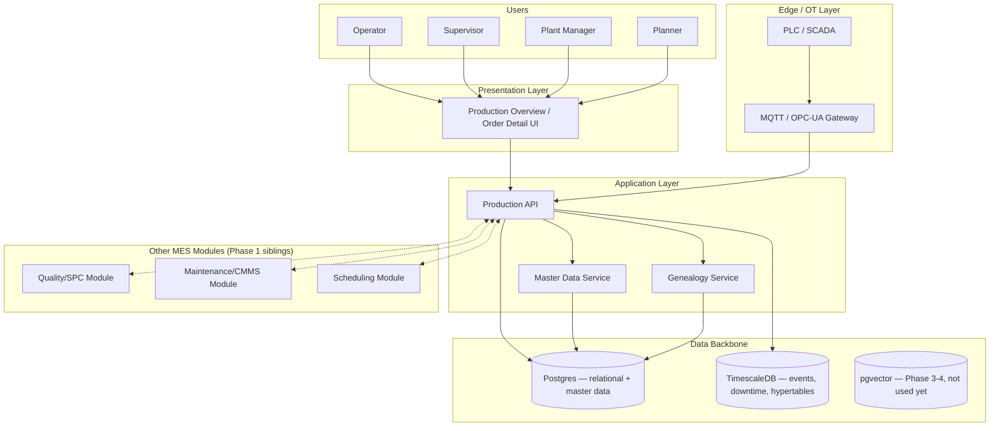

# High-Level Architecture — Production Module

**Related docs:** [Technical Design](./02-technical-design-document.md) · [Detailed Architecture](./06-detailed-architecture.md) · [Database Model](./03-database-model.md)

This document positions the Production Module within the overall MES SaaS architecture already defined in `docs/mes-ai-architecture-blueprint.md` §1, and expands the "Application Layer" band specifically for Production.

---

## 1. System context

---

## 2. Major components

| Component | Responsibility |
|---|---|
| **Production API** | Owns Production Order lifecycle (both Work Order and Batch Order paths), operation/phase execution logging, downtime logging. The single write-path for anything in the `production_order` table family. |
| **Master Data Service** | Owns Site/Area/Production Unit/Equipment/Shift/Product/Routing/Recipe configuration (Section-4 doc). Read-heavy from Production API's perspective — Production API resolves references (e.g., "which routing is active for this product") through this service rather than owning that data itself. |
| **Genealogy Service** | Owns the `lot` and `genealogy_link` tables and serves forward/backward traceability queries (recursive CTE per Database Model §5). Kept as a distinct logical component because genealogy queries are read-pattern-different (graph traversal) from the rest of Production's CRUD-shaped access. |
| **Edge/MQTT Gateway** | Translates PLC/SCADA/OPC-UA signals into Production API calls or direct writes to the TimescaleDB event tables — e.g., a temperature sensor feed populating `phase_execution.parameter_readings` automatically instead of manual operator entry. |
| **Quality/Maintenance/Scheduling Modules** | Sibling Phase-1 modules, integrated via API calls, not shared tables — Production references their IDs (`sample_id`, equipment health status) but doesn't own their schemas. |

---

## 3. Why this shape

- **Production API as the single write-path** avoids the classic MES failure mode described in the parent architecture blueprint (§3, scheduling section) — a system where multiple services can independently mutate order state ends up with inconsistent status, which is exactly what breaks trust in shop-floor data.
- **Master Data Service is separated from Production API** specifically because master data changes (a new Routing version, a reconfigured Production Unit) have a fundamentally different change-approval and versioning need (Master Data Configuration doc §2.7-2.8) than production execution events, which are append-only and never edited after the fact.
- **Genealogy as its own logical service** — even though it can share the same physical database as Production API in Phase 1 (no need for a separate deployable yet), keeping the query logic architecturally distinct makes it straightforward to split into its own service later if genealogy query volume grows independently of production-order volume (a common pattern once Traceability becomes report-heavy).
- **Edge Gateway is a translation layer, not a pass-through** — this is where OPC-UA/MQTT payloads get mapped into the tenant's specific `parameter_targets` JSON shape (Database Model §3, `recipe_phase.parameter_targets`), so the Production API never needs to know about protocol-level details.

---

## 4. What's deliberately NOT in this diagram

- AI/Agent layer (copilot, predictive models) — Phase 3-4, not part of Core MES Production scope, see parent blueprint §3.
- Detailed API contracts, state machines, sequence diagrams — see [Detailed Architecture](./06-detailed-architecture.md).
- Deployment/infra topology (containers, load balancers, CI/CD) — belongs in a separate DevOps/infra doc, not modeled here.

