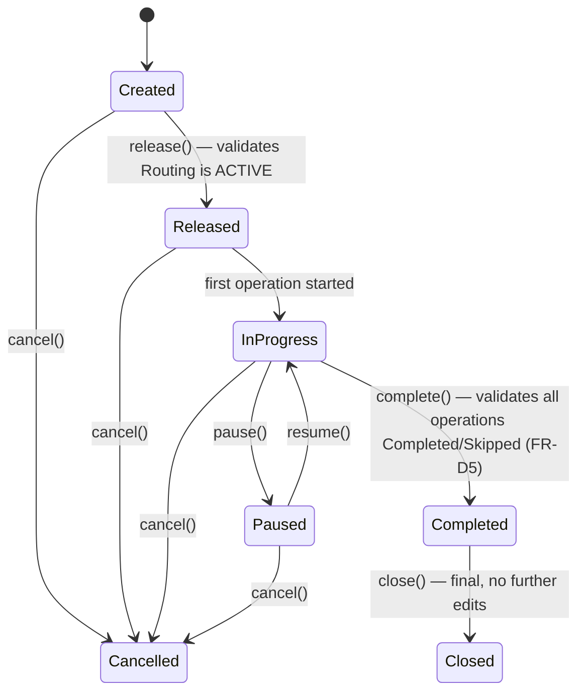
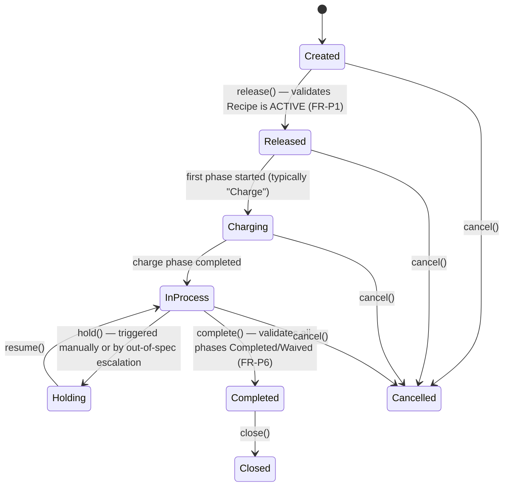
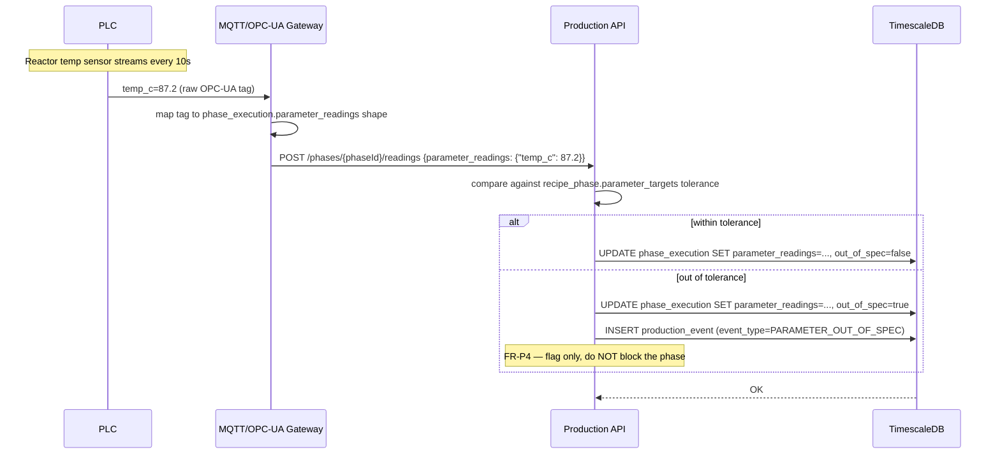
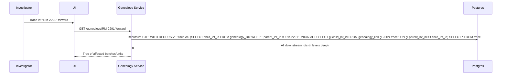

# Detailed Architecture — Production Module

**Related docs:** [Technical Design](./02-technical-design-document.md) · [High-Level Architecture](./05-high-level-architecture.md) · [Database Model](./03-database-model.md)

This document goes one level deeper than the TDD/HLA: state machines, sequence diagrams for the key flows, and the specific internal logic that determines *how* the Production API enforces the Functional Design's rules.

---

## 1. Work Order state machine (Discrete)



**Enforcement point:** the `complete()` transition is where FR-D5 lives — the API queries all `operation_execution` rows for the order and rejects (`409`, per TDD §4) if any are still `PENDING` or `IN_PROGRESS`.

---

## 2. Batch Order state machine (Process)



**Key difference from Discrete:** `Holding` is a first-class state (not just a pause), because a Process hold often has quality/compliance implications (e.g., a batch held pending QA disposition) that a simple "paused" label doesn't capture — this distinction matters for reporting and for who's allowed to resume (FDD §5.1 implies hold-resume may require different authorization than a Discrete pause/resume, though role-gating of the resume action is left to the Master Data Configuration's role scoping, not hardcoded here).

---

## 3. Sequence: releasing and running a Discrete Work Order

```mermaid
sequenceDiagram
    participant Planner
    participant UI
    participant API as Production API
    participant MDS as Master Data Service
    participant DB as Postgres

    Planner->>UI: Release Work Order WO-48201
    UI->>API: POST /production-orders/{id}/release
    API->>MDS: GET routing status for product
    MDS-->>API: routing_id, status=ACTIVE
    API->>DB: BEGIN; SET app.current_tenant; UPDATE status=Released
    DB-->>API: OK
    API-->>UI: 200 {status: "Released"}

    Note over UI: Operator starts first operation
    UI->>API: POST /operations/{opId}/start
    API->>DB: INSERT operation_execution (status=IN_PROGRESS, actual_start=now())
    API->>DB: UPDATE production_order status=InProgress (if first op)
    DB-->>API: OK
    API-->>UI: 200

    Note over UI: Operator completes operation, logs qty
    UI->>API: POST /operations/{opId}/complete {qty_good: 48, qty_scrap: 2}
    API->>DB: UPDATE operation_execution SET status=COMPLETED, actual_end=now(), quantity_good=48, quantity_scrap=2
    API->>DB: INSERT production_event (event_type=OPERATION_COMPLETED)
    DB-->>API: OK
    API-->>UI: 200
```

---

## 4. Sequence: Process phase with edge-fed parameter readings



**Design note:** the Gateway performs tag-to-schema mapping so the Production API never parses raw OPC-UA/MQTT payloads directly — this keeps protocol-specific complexity isolated to one component, matching HLA §3's reasoning.

---

## 5. Sequence: forward genealogy trace



**Why recursive CTE over an application-layer loop:** genealogy chains can be arbitrarily deep (a blended ingredient feeding into a sub-batch feeding into a final batch); a single recursive SQL query is both simpler and avoids N+1 query patterns an application-layer walk would introduce.

---

## 6. OEE / Yield calculation logic

### Discrete OEE (FR-D4)
```
Availability = Run Time / Planned Production Time
Performance  = (Ideal Cycle Time × Total Count) / Run Time
Quality      = Good Count / Total Count
OEE          = Availability × Performance × Quality
```
`Ideal Cycle Time` comes from `equipment.ideal_cycle_time_seconds` (Database Model §2) for the equipment actually used per `operation_execution.equipment_id` — not a routing-level default, so OEE reflects the real equipment path even if an operator used a different station than the routing's default.

### Process Yield/Uptime (FR-P5)
```
Yield  = Actual Output / Theoretical Yield (from recipe.theoretical_yield)
Uptime = In-Process Time / Scheduled Time
```
Both computed per Production Unit per shift, same aggregation grain as Discrete OEE, so the Production Overview can show both metric families side-by-side without the underlying calc windows diverging.

---

## 7. What's deliberately deferred past this document

- Exact retry/idempotency semantics for the Edge Gateway's high-frequency reading writes (relevant once real sensor throughput is known — premature to design against assumed volume).
- Multi-co-product yield calculation (FDD open question #3).
- Formal approval workflow for Routing/Recipe version promotion (Master Data Configuration §4) — left as a tenant-level configuration toggle, not designed in detail here.
